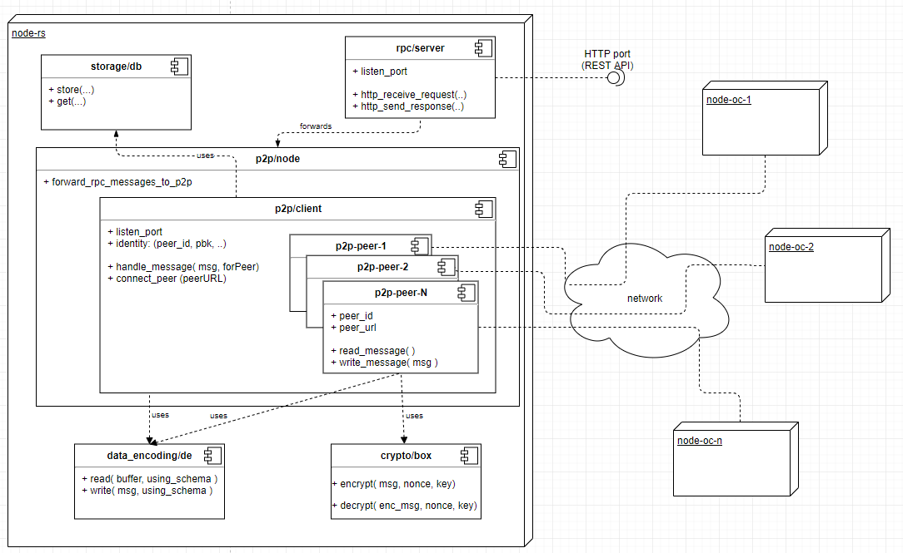
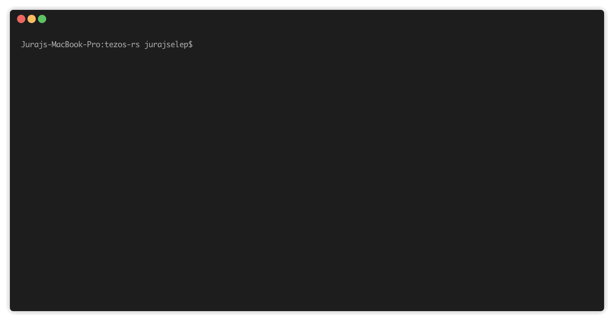
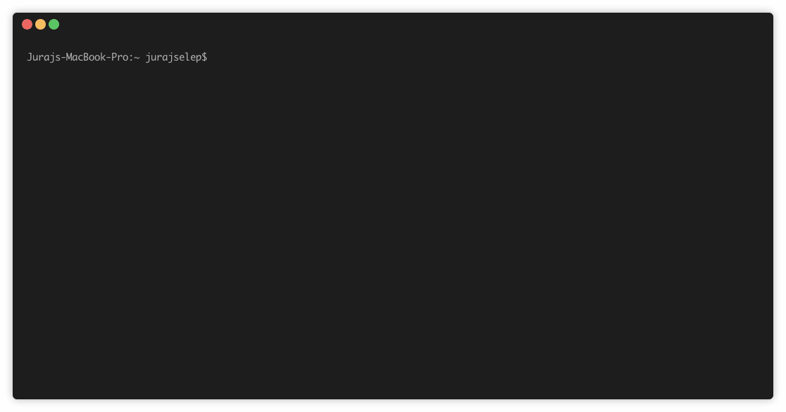
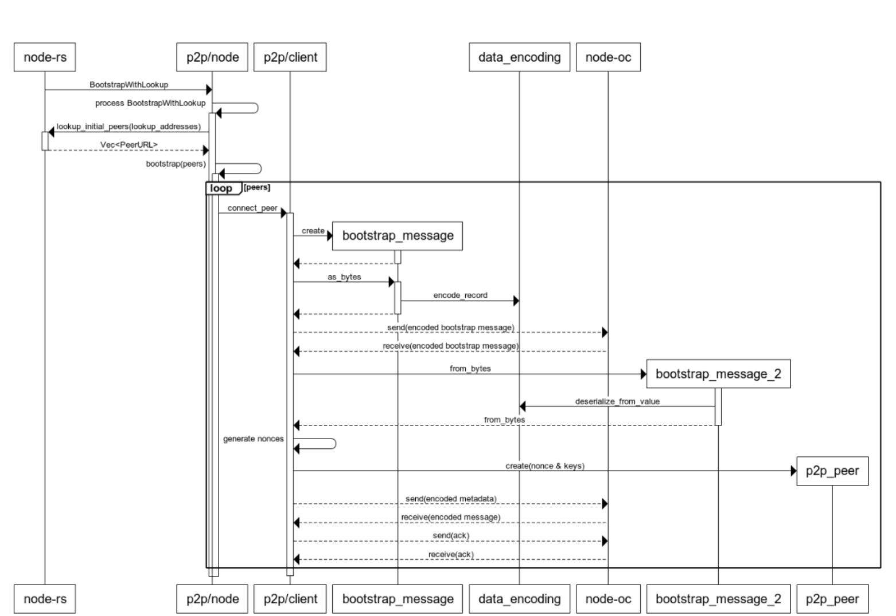
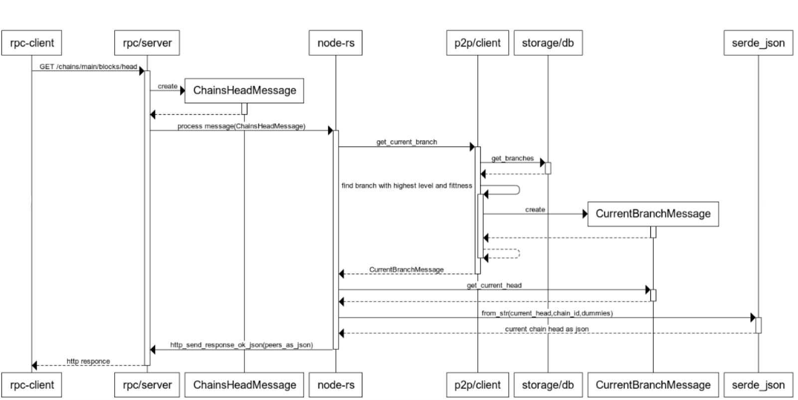

Tezos-rs
===========

The purpose of this project is to implement a secure, trustworthy, open-source Tezos node in Rust. In addition to implementing a new node, the project seeks to maintain and improve the Tezos node wherever possible. 

The project can be considered as a proof of concept. This PoC demonstrates the viability of a node build that uses Rust. 

## Components

The current PoC of the Tezos node consists of multiple components which are yet to be fully implemented:

* **p2p/client:** This is the p2p component responsible for receiving and sending messages within Tezos network. Internally, p2p allocates a component, called a p2p-peer, for each node within the reachable network. The p2p-peer listens to incoming messages from peers and routes requests to individual peers. The p2p/client uses separate components for serialization/deserialization of messages between Tezos message format and Rust structures.

* **data_encoding/de:** All incoming messages are transformed into standard Rust structures for easy manipulation using de component. This component implements serialization and deserialization of all data types used in Tezos messages.

* **crypto/box:** Component contains cryptographic algorithms for encryption and decryption of messages

* **storage/db:** In the current phase (PoC), this is a very simplistic in memory DB for storing information about the current state of the blockchain.

* **rpc/server:** the component used for the implementation of tezos-rs REST API. Using the nodes REST api, the user is able to get insights about the current state of the node as well as execute commands on the node

The relations between individual components are described in the diagram depicted below.




# How to run the node

Requirements
------------

**1. Install Rust** 

We recommend installing Rust through rustup.

Run the following in your terminal, then follow the onscreen instructions.

```
curl https://sh.rustup.rs -sSf | sh
```

**2. Rust version** 

Rust nightly is required to build this project.
```
rustup install nightly-2019-03-14
rustup default nightly-2019-03-14
```
Application has been tested to compile with `rustc 1.35.0-nightly (bc44841ad 2019-03-14)`.


Building
--------

**3. Build node** 

On linux systems:

```
export SODIUM_USE_PKG_CONFIG=1
cargo build
```

On windows systems with vcpkg:
```
set SODIUM_USE_PKG_CONFIG=1
set VCPKGRS_DYNAMIC=1
cargo build
```

Run
------------
**4. Run node** 

```
cargo run  
```




# RPC API

#### /network/points
Returns connected peers, after successful authentication.

```
curl http://127.0.0.1:18732/network/points
```




#### /chains/main/blocks/head
Returns current head.

```
curl http://127.0.0.1:18732/chains/main/blocks/head
```


# Run configuration

**RPC port**
```
--rpc-port 8732
```

**P2P port**
```
--p2p-port 9732
```

**Bootstrap peers**
```
--peers 127.0.0.1:7777,127.0.0.1:8888
```

**Bootstrap address**

```
--bootstrap-lookup-address boot.tzalpha.net,bootalpha.tzbeta.net
```

**Location to identity.json file**
```
--identity /opt/tezos-env/rust-node/identity.json
```

**Disable JSON messages logging**
```
--logj false
```

**Disable HEX messages logging**
```
--logh false
```


e.g.:
```
cargo run -- --rpc-port 9998 --p2p-port 7533 --identity ./config/identity.json --logj true --logh false
```


# What node can currently do

The two diagrams shown below depict the interaction between objects in a sequential order. The sequence of actions is described in a short sentence written above each diagram.

#### 1. Connect to the Tezos p2p network and listen for incoming connections




#### 2. Return the current head of chain


