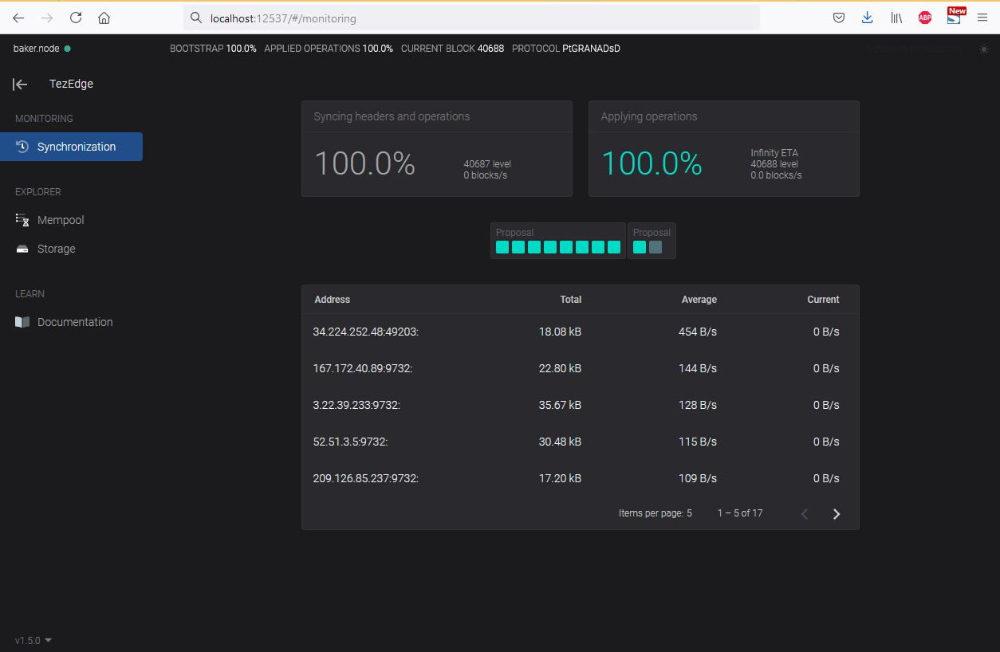
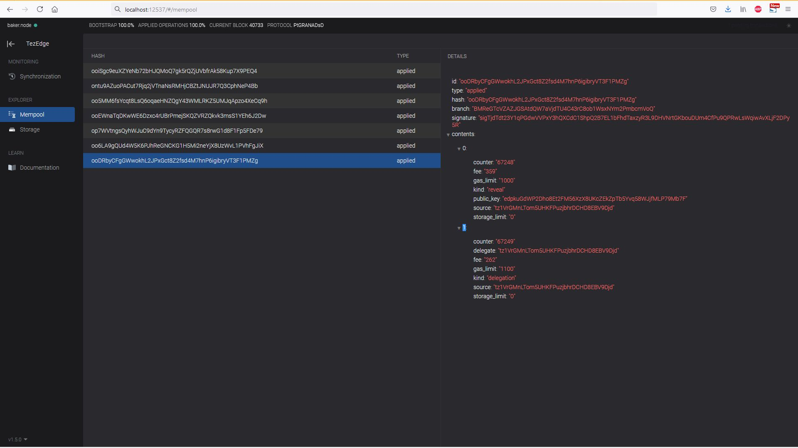

# Runing baker/endorser/accuser on Testnet (Granadanet)

## Table of Contents
* [Get free XTZ](#get-free-xtz)
* [Run from sources/binaries](#run-from-sourcesbinaries)
* [Run with Docker](#run-with-docker)

# Get free XTZ

https://tezos.gitlab.io/introduction/howtouse.html#get-free-tez

Download free faucets:

https://faucet.tzalpha.net/

_It is recommended to have different accounts for baker/endorser/accuser._
E.g.:
```
baker.faucet.json
endorser.faucet.json
accuser.faucet.json
```

# Run from sources/binaries

1. **Create working directory**

   _Tezos baker requires access to the context directory, which is produced by TezEdge node._
    ```
    mkdir /tmp/data-dir-010-PtGRANAD
    mkdir /tmp/data-dir-010-PtGRANAD/client

    cp baker.faucet.json /tmp/data-dir-010-PtGRANAD
    cp endorser.faucet.json /tmp/data-dir-010-PtGRANAD
    cp accuser.faucet.json /tmp/data-dir-010-PtGRANAD
    ```

2. **Run TezEdge node**

   At first you need to [build TezEdge from sources](../../README.md#build-from-source-code) and then check [how to run it](../../README.md#how-to-run).

   E.g. for granadanet to support baking/endorsing:

   _Note: This cmd runs from the main git sources directory_
   ```
   LD_LIBRARY_PATH=./tezos/sys/lib_tezos/artifacts ./target/release/light-node \
    --network "granadanet" \
    --identity-file "/tmp/data-dir-010-PtGRANAD/identity.json" \
    --identity-expected-pow 26.0 \
    --tezos-data-dir "/tmp/data-dir-010-PtGRANAD/context_data" \
    --bootstrap-db-path "/tmp/data-dir-010-PtGRANAD/tezedge_data" \
    --peer-thresh-low 30 --peer-thresh-high 45 \
    --protocol-runner "./target/release/protocol-runner" \
    --init-sapling-spend-params-file "./tezos/sys/lib_tezos/artifacts/sapling-spend.params" \
    --init-sapling-output-params-file "./tezos/sys/lib_tezos/artifacts/sapling-output.params" \
    --p2p-port 12534 --rpc-port 12535 \
    --tokio-threads 0 \
    --ocaml-log-enabled false \
    --one-context \
    --log terminal \
    --log-level info \
    --log-format simple
   ```

   *You should see output:*
   ```
   Jun 10 12:29:34.855 INFO Configured network ["granadanet", "granada"] -> TEZOS_GRANADANET_2021-05-21T15:00:00Z
   Jun 10 12:29:34.855 INFO Checking zcash-params for sapling... (1/5)
   Jun 10 12:29:34.855 INFO Found existing zcash-params files, output_path: "/home/dev/.zcash-params/sapling-output.params", spend_path: "/home/dev/.zcash-params/sapling-spend.params", candidate_dir: "/home/dev/.zcash-params"
   Jun 10 12:29:34.855 INFO Loading identity... (2/5)
   Jun 10 12:29:34.855 INFO Generating new tezos identity. This will take a while, expected_pow: 26
   ...
   ```

3. **Wait for TezEdge node to sync with network**

   _Check RPC:_
   ```
   curl http:://localhost:12535/chains/main/blocks/head
   ```

4. **Build Tezos Baker/Endorser/Accuser binaries from source**

   Please, see [https://tezos.gitlab.io/introduction/howtoget.html#building-from-sources-via-opam](https://tezos.gitlab.io/introduction/howtoget.html#building-from-sources-via-opam)

   After successfull compilation, you should see this binaries in Tezos source directory:
   ```
   tezos-accuser-010-PtGRANAD
   tezos-baker-010-PtGRANAD
   tezos-endorser-010-PtGRANAD
   tezos-client
   ```

4. **Initialize keys**

   _TezEdge node have to be synced already._
   ```
   ./tezos-client \
      --endpoint "http://localhost:12535" \
      --base-dir "/tmp/data-dir-010-PtGRANAD/client" \
      -p PtGRANADsDU8R9daYKAgWnQYAJ64omN1o3KMGVCykShA97vQbvV \
      --log-requests \
       activate account baker with "/tmp/data-dir-010-PtGRANAD/baker.faucet.json"
   ```

   ```
   ./tezos-client \
      --endpoint "http://localhost:12535" \
      --base-dir "/tmp/data-dir-010-PtGRANAD/client" \
      -p PtGRANADsDU8R9daYKAgWnQYAJ64omN1o3KMGVCykShA97vQbvV \
      --log-requests \
       activate account endorser with "/tmp/data-dir-010-PtGRANAD/endorser.faucet.json"
   ```

   ```
   ./tezos-client \
      --endpoint "http://localhost:12535" \
      --base-dir "/tmp/data-dir-010-PtGRANAD/client" \
      -p PtGRANADsDU8R9daYKAgWnQYAJ64omN1o3KMGVCykShA97vQbvV \
      --log-requests \
       activate account accuser with "/tmp/data-dir-010-PtGRANAD/accuser.faucet.json"
   ```

   *Once operations are baked, you should see output:*
   ```
   ...
   Account baker (tz1XXXXXX) activated with ꜩ76351.572618.
   Account endorser (tz1XXXXXX) activated with ꜩ76351.572618.
   Account accuser (tz1XXXXXX) activated with ꜩ76351.572618.
   ...
   ```

5. **Register baker/endorser delegate**

   _TezEdge node have to be synced already._
   ```
   ./tezos-client \
      --endpoint "http://localhost:12535" \
      --base-dir "/tmp/data-dir-010-PtGRANAD/client" \
      -p PtGRANADsDU8R9daYKAgWnQYAJ64omN1o3KMGVCykShA97vQbvV \
      --log-requests \
       register key baker as delegate
   ```

   ```
   ./tezos-client \
      --endpoint "http://localhost:12535" \
      --base-dir "/tmp/data-dir-010-PtGRANAD/client" \
      -p PtGRANADsDU8R9daYKAgWnQYAJ64omN1o3KMGVCykShA97vQbvV \
      --log-requests \
       register key endorser as delegate
   ```

   *Once operations are baked, you should see output:*
   ```
   ...
   This revelation was successfully applied
   ...
   This delegation was successfully applied
   ...
   ```

6. **Run baker**
   ```
   ./tezos-baker-010-PtGRANAD \
      --endpoint "http://localhost:12535" \
      --log-requests \
      --base-dir "/tmp/data-dir-010-PtGRANAD/client" \
      run with local node "/tmp/data-dir-010-PtGRANAD/context_data" baker
   ```

   *You should see output:*
   ```
   Node is bootstrapped.
   ...
   Baker started.
   ...
   Jun 10 13:11:53.782 - 010-PtGRANAD.delegate.baking_forge: no slot found at level 41427 (max_priority = 64)

   ...
   ```

7. **Run endorser**
   ```
   ./tezos-endorser-010-PtGRANAD \
      --endpoint "http://localhost:12535" \
      --log-requests \
      --base-dir "/tmp/data-dir-010-PtGRANAD/client" \
      run endorser
   ```

   *You should see output:*
   ```
   Node is bootstrapped.
   ...
   Endorser started.
   ...
   ```

8. **Run accuser**
   ```
   ./tezos-accuser-010-PtGRANAD \
      --endpoint "http://localhost:12535" \
      --log-requests \
      --base-dir "/tmp/data-dir-010-PtGRANAD/client" \
      run
   ```

   *You should see output:*
   ```
   Node is bootstrapped.
   ...
   Accuser started.
   ...
   ```

# Run with Docker

1. **Create external volume**

   _Tezos baker requires access to the context directory, which is produced by TezEdge node._
    ```
    docker volume create --name=data-dir-010-PtGRANAD
    ```

2. **Run TezEdge node + TezEdge explorer**

   _Download TezEdge source code_
   ```
   git clone https://github.com/tezedge/tezedge
   cd tezedge/baking
   ```

   ```
   NODE_HOST=localhost docker-compose -f docker-compose.node.010-granadanet.yml up
   ```

3. **Wait for TezEdge node to sync with network**

   _Check explorer for 100%:_
   

   _Check RPC:_
   ```
   curl http:://localhost:12535/chains/main/blocks/head
   ```

4. **Initialize keys**

   _TezEdge node have to be synced already._
   ```
   NODE_HOST=localhost NODE_RPC_PORT=12535 DELEGATE_ALIAS=baker DELEGATE_FAUCET_JSON_FILE=./baker.faucet.json docker-compose -f docker-compose.init.010-granadanet.yml up
   NODE_HOST=localhost NODE_RPC_PORT=12535 DELEGATE_ALIAS=baker DELEGATE_FAUCET_JSON_FILE=./baker.faucet.json docker-compose -f docker-compose.init.010-granadanet.yml down

   NODE_HOST=localhost NODE_RPC_PORT=12535 DELEGATE_ALIAS=endorser DELEGATE_FAUCET_JSON_FILE=./endorser.faucet.json docker-compose -f docker-compose.init.010-granadanet.yml up
   NODE_HOST=localhost NODE_RPC_PORT=12535 DELEGATE_ALIAS=endorser DELEGATE_FAUCET_JSON_FILE=./endorser.faucet.json docker-compose -f docker-compose.init.010-granadanet.yml down

   NODE_HOST=localhost NODE_RPC_PORT=12535 DELEGATE_ALIAS=accuser DELEGATE_FAUCET_JSON_FILE=./accuser.faucet.json docker-compose -f docker-compose.init.010-granadanet.yml up
   NODE_HOST=localhost NODE_RPC_PORT=12535 DELEGATE_ALIAS=accuser DELEGATE_FAUCET_JSON_FILE=./accuser.faucet.json docker-compose -f docker-compose.init.010-granadanet.yml down
   ```

   *Once operations are baked, you should see output:*
   ```
   ...
   Account baker (tz1XXXXXX) activated with ꜩ76351.572618.
   Account endorser (tz1XXXXXX) activated with ꜩ76351.572618.
   Account accuser (tz1XXXXXX) activated with ꜩ76351.572618.
   ...
   ```

5. **Register baker/endorser delegate**

   _TezEdge node have to be synced already._
   ```
   NODE_HOST=localhost NODE_RPC_PORT=12535 DELEGATE_ALIAS=baker docker-compose -f docker-compose.register-delegate.010-granadanet.yml up
   NODE_HOST=localhost NODE_RPC_PORT=12535 DELEGATE_ALIAS=baker docker-compose -f docker-compose.register-delegate.010-granadanet.yml down

   NODE_HOST=localhost NODE_RPC_PORT=12535 DELEGATE_ALIAS=endorser docker-compose -f docker-compose.register-delegate.010-granadanet.yml up
   NODE_HOST=localhost NODE_RPC_PORT=12535 DELEGATE_ALIAS=endorser docker-compose -f docker-compose.register-delegate.010-granadanet.yml down
   ```

   _Check explorer - mempool_
   

   *Once operations are baked, you should see output:*
   ```
   ...
   This revelation was successfully applied
   ...
   This delegation was successfully applied
   ...
   ```

6. **Run baker**
   ```
   docker-compose -f docker-compose.baker.010-granadanet.yml pull
   NODE_HOST=localhost NODE_RPC_PORT=12535 DELEGATE_ALIAS=baker docker-compose -f docker-compose.baker.010-granadanet.yml up
   ```

   *You should see output:*
   ```
   tezos-baker-010-PtGRANAD_1  | Node is bootstrapped.
   tezos-baker-010-PtGRANAD_1  | Baker started.
   tezos-baker-010-PtGRANAD_1  | Jun  9 22:25:39.760 - 010-PtGRANAD.delegate.baking_forge: no slot found at level 40714 (max_priority = 64)
   ...
   ```

7. **Run endorser**
   ```
   docker-compose -f docker-compose.endorser.010-granadanet.yml pull
   NODE_HOST=localhost NODE_RPC_PORT=12535 DELEGATE_ALIAS=endorser docker-compose -f docker-compose.endorser.010-granadanet.yml up
   ```

   *You should see output:*
   ```
   tezos-endorer-010-PtGRANAD_1  | Node is bootstrapped.
   tezos-endorer-010-PtGRANAD_1  | Endorser started.
   ...
   ```

8. **Run accuser**
   ```
   docker-compose -f docker-compose.accuser.010-granadanet.yml pull
   NODE_HOST=localhost NODE_RPC_PORT=12535 docker-compose -f docker-compose.accuser.010-granadanet.yml up
   ```

   *You should see output:*
   ```
   tezos-accuser-010-PtGRANAD_1  | Node is bootstrapped.
   tezos-accuser-010-PtGRANAD_1  | Accuser started.
   ...
   ```
